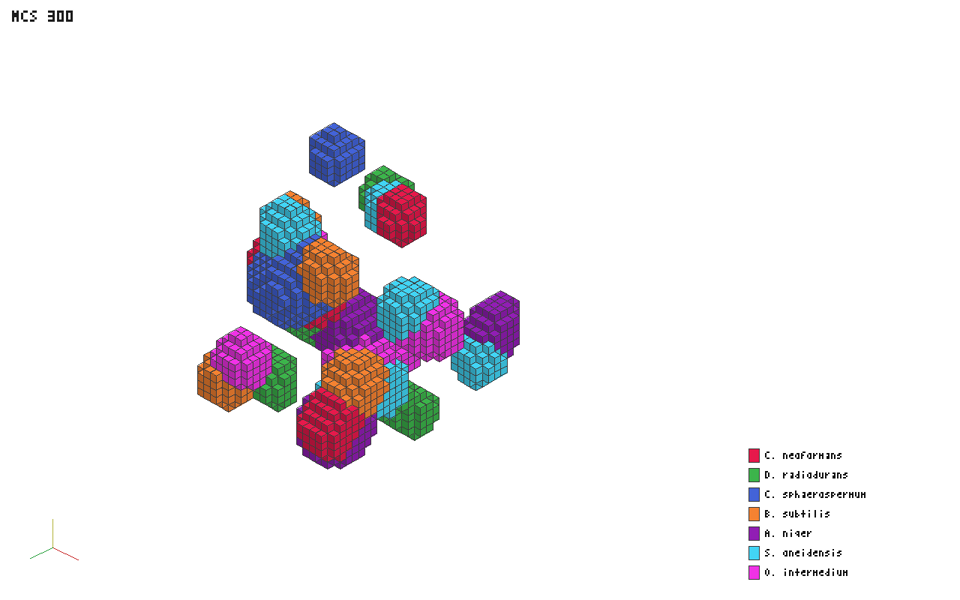

# Biofilm CPM in Odin — AoS / SoA / AoSoA + SIMD + raylib voxels

Odin port of `biofilms_potts.jl` (3D Cellular Potts + melanin/nutrient
reaction-diffusion) with a voxel renderer in the style of the reference
screenshot: shaded species-coloured cubes with outlines, MCS counter
top-left, species legend right, axes gizmo bottom-left.


*Headless output (`render/ppm.odin`, no GPU): N=40, MCS 300, seed 42.
`biofilm --n 40 --mcs 300 --seed 42 --ppm preview.ppm` reproduces it.*

## Binaries

| Binary | Needs | What |
|---|---|---|
| `biofilm` | nothing (stdlib) | headless sim + Julia-compatible CSV + PPM voxel render |
| `biofilm-viewer` | raylib, display | interactive orbit viewer (`SPACE` +10 MCS, `R` reset, `1/2/3` layout) |
| `shaders/field_diffusion.comp` | Vulkan, opt-in | compute port of the field sweeps (design in `shaders/design.md`) |

```sh
./build.sh            # biofilm (headless) + tests
./build.sh viewer     # + biofilm-viewer (needs raylib in link path)
./build.sh all        # + compiles the compute shader if glslangValidator exists

./biofilm --n 40 --mcs 100 --seed 42 --layout aos --ppm out.ppm
./biofilm --no-coupled --n 20 --mcs 2 --seed 42   # CPM-only, no PDE
./biofilm --n 20 --mcs 400 --seed 42 --cells 2 --frames anim/f --every 4 \
  --width 960 --height 600 --no-stats             # 100 PPMs -> mp4 via ffmpeg
./biofilm-viewer --n 30 --mcs 4 --seed 42
odin test tests/
```

`odin/biofilm_seed42_mcs400.mp4` is a ready-made example: N=20, seed 42,
one frame per 4 MCS to 400 at 12 fps, encoded with
`ffmpeg -framerate 12 -i f_%d.ppm -c:v libx264 -pix_fmt yuv420p`.

## Layouts (all three ship, selectable at runtime)

```
--layout aos    Array of Structures:  []Cell  (one struct per cell)
--layout soa    Structure of Arrays:  struct of []u8/[]i32/[]f32 columns
--layout aosoa  Array of Structures of Arrays: []Cell_Block, BLOCK=8
```

`cpm/layouts.odin` holds the canonical forms. Cell IDs are 1-based on the
lattice (`0` medium, `-1` wall) and index slots as `id-1` in every layout,
so all three consume the RNG stream in identical order: **same seed gives
bit-identical integer state in every layout** (volumes, counts), pinned by
`tests/layouts_test.odin`. Float accumulations (COM, melanin means) agree
to 1e-4.

`AOSOA_BLOCK = 8` is one choice everywhere: AVX2 `#simd[8]f32` width,
Vulkan subgroup size in `field_diffusion.comp`, one cache line per
`com_x` lane-group. Measured N=40/100 MCS (O2):

| layout | wall | CSV vs AoS |
|---|---|---|
| aos | 0.24 s | — |
| soa | 0.24 s | identical |
| aosoa | 0.24 s | identical |

Coupled mode (PDE + projection + pairwise diagnostic, i.e. the full Julia
workload) costs ~0.31 s/run at N=40 — about 30% over CPM-only, dominated
by the radial→3D projection sweep; the 1D PDE itself is negligible.

No layout wins at N=40 because the scalar Metropolis core dominates and
costs the same everywhere. SoA/AoSoA pay off in the streaming field
sweeps at larger N (and AoSoA is the layout the compute shader wants —
see below). The honest summary: AoS for readability, AoSoA for the
GPU upgrade path, all three tested equivalent.

## SIMD (shipped, on by default)

`cpm/fields_simd.odin`: the two reaction-diffusion sweeps over 8-wide
x-runs with `#simd[8]f32`, unaligned loads/stores
(`intrinsics.unaligned_load/store` — plain `^Vec` dereference emits
aligned MOVAPS and faults on 4-byte-aligned rows). Per-lane production
terms (`α_M`, uptake) are gathered scalar then lifted with
`simd.from_array`; negatives clamped lane-wise. Scalar reference stays in
`cpm/sim.odin`; `test_simd_matches_scalar` asserts max diff < 1e-4
(SIMD reassociates the Laplacian sum, so tolerance — not bits — is the
contract).

Deliberately NOT vectorised: the Metropolis copy attempts (random
gather/scatter, 26-neighbour adhesion gather, data-dependent branch,
per-cell atomics). Same conclusion as the JACC port: parallelising that
core changes the dynamics (checkerboard ≠ random-sequential).

## Compute shaders (provided, opt-in)

`shaders/field_diffusion.comp` + `shaders/design.md`. One dispatch for
the field sweeps only; the Metropolis core stays on CPU (§1 of the design
doc explains why it is slower on GPU at these sizes). Memory model is
**one allocation**: `cpm/arena.odin` packs lattice + all float fields
into a single 64-byte-aligned backing buffer with recorded offsets, which
maps 1:1 onto one `VkBuffer` (bindless index 0, offsets as push
constants). Rule of thumb: SIMD fields + raylib voxels win at N≤60;
compute pays for the sweeps at N≥60; the Metropolis core never moves.

## Validation vs Julia

Same seed is NOT the same trajectory across languages (splitmix64 here vs
MersenneTwister there — statistical parity only, per `validate_serial.jl`
contract). What is checked:

- CSV columns match `validate_serial.jl` format (`CSV,seed,species,vol,ncells,mel,survived`).
- N=40, 6 cells/species, 100 MCS, seed 42: melanin ordering CS > CN > AN
  (1.62 > 1.31 > 0.85 here vs 1.44 for CS in the Julia report — same
  ordering, same magnitudes, different stream), 42/42 parcels persist,
  all layouts identical.
- Coupled parity (default mode = Julia's `main_coupled` workload): N=40,
  100 MCS, seed 42 gives m=0.7786 (Julia 0.779), P_eff/P₀=2.72
  (Julia e≈2.72), c_mean=0.0239 (Julia 0.024) — closed-form-dominated
  quantities agreeing to 3 decimals. Lattice trajectory is provably
  unaffected by coupling (one-way; `test_coupling_moves_no_sites`), so
  all CSVs above hold in both modes.
- `odin test tests/`: layout equivalence, SIMD-vs-scalar, determinism,
  voxel collection, coupling lattice-identity, membrane closed forms,
  coupled determinism — 7/7 pass.

## Files

```
odin/
  main.odin            headless CLI (CSV + PPM)
  cpm/params.odin      species registry, beta/alpha/uptake, J matrix
  cpm/rng.odin         splitmix64 deterministic stream
  cpm/arena.odin       ONE huge allocation (bindless-ready offsets)
  cpm/layouts.odin     AoS / SoA / AoSoA canonical forms
  cpm/sim.odin         init, Metropolis step, delta_H, snapshots
  cpm/fields_simd.odin #simd[8]f32 field sweeps (default path)
  cpm/radiolysis.odin  1D radiodialysis PDE + radial<->3D coupling (coupled mode)
  render/palette.odin  FIG_COLORS parity (screenshot legend)
  render/voxels.odin   occupied-site gather + face-culling masks
  render/ppm.odin      headless isometric rasterizer (CI check)
  viewer/main.odin     raylib orbit viewer (publication view)
  shaders/             compute shader + placement rationale
  tests/               odin test suite (layouts, SIMD, determinism, coupling)
```
